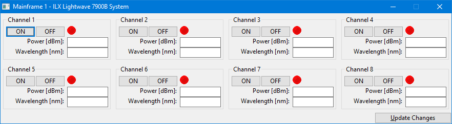

# ILX Lightwave 7900B - Python GUI

ILX Lightwave 7900B - Python GUI  is a wxPython graphical user interface based on Python to control the  8 laser channels.

The options are as follows: 
- turn on and off each channel
- set the power level of each channel
- set the wavelength of each channel

## Installing

In order to use it, you must have installed PyVisa, wxPython and [NiVISA][linkNiVISA].

Then simply run the `MainFrame.py` file.

**You will probably need to edit MainFrame.py to put your GPIB address.**

[linkNiVISA]: http://www.ni.com/download/ni-visa-16.0/6184/en/
